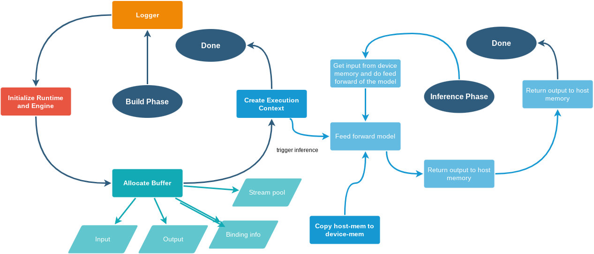
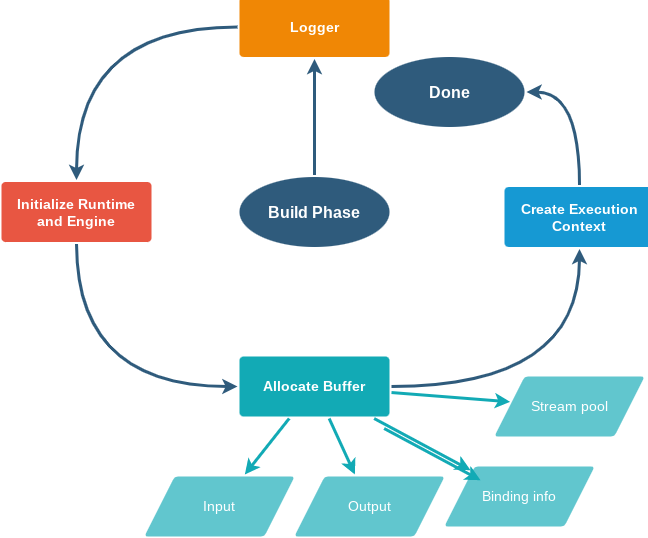
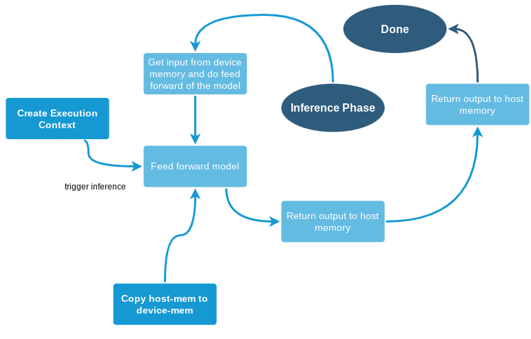

## TENSOR-RT Simplified Introduction
---

<style>
  .center {
    display: block;
    margin-left: auto;
    margin-right: auto;
    width: 50%;
  }
</style>

<div>
  <lic><a href="../../"><h4>MAIN PAGE</h4></a></lic>
  <lic><a href="../"><h4>TENSOR-RT PAGE</h4></a></lic>
</div>

## TENSOR-RT's Simplified Introduction
---
January 16th, 2022
<!-- <p align="center"> -->
<p class="center">
    <b>Image 1. Summary of Tensor-RT's Build and Inference phases. </b>
</p>

<!--  -->


In this review, we are gonna try to review one of the fastest inference engine available today, which is Tensor-RT!

The code/coding material are available at [here](https://github.com/briliantnugraha/briliantnugraha.github.io/tree/main/tensorrt/understand_trt/tensorrt_explanation). For tensor-rt model, you can convert it from this [YOLOX-m's ONNX model here](https://tinyurl.com/yoloxmonnx).

Nowadays, a lot of frameworks/engines for deep learning inferencing are available open sources. To my knowledge, the top 5 inference engine that are very popular are:
- ONNXRuntime.
- Pytorch/Torchscript.
- Mxnet.
- Tensorflow/Tf-lite.
- Paddle/Paddle-lite.
- Tensor-RT.
However, by no means, using NVIDIA gpus, Tensor-RT is still the king of the inference time according to [this](https://www.es.ele.tue.nl/~sander/publications/scopes20-gpu.pdf), [this](https://www.mcs.anl.gov/research/projects/waggle/cfp/slides/2021/pdf/s1-3.pdf), and [this](https://cpb-us-e1.wpmucdn.com/you.stonybrook.edu/dist/6/1671/files/2021/10/verma2021dledgecompilers.pdf). Another good alternative reading material is also available [here](https://learnopencv.com/how-to-convert-a-model-from-pytorch-to-tensorrt-and-speed-up-inference/).

## HOW DOES TENSOR-RT WORK?
---                                     
Simplifying [the official documentation](https://docs.nvidia.com/deeplearning/tensorrt/developer-guide/index.html#work), we could divide **Tensor-RT** into two parts:

### *BUILD* Phase
Assuming that you've successfully converted your TRT-Model from ONNX, Tensor-RT will then require us to register a few things:
1. Create Logger (a must instance that will be used as our model ID).
2. CreateRuntime and Engine
3. Allocate Buffer (Input, Output, Bindings, and Stream)
4. Create Engine Context

Wait, hold on a sec, what are those list by the way?

**First**, Logger is simply a activity recorder that is compulsary (i.e. a must have) to do the inference with Tensor-RT engine. 
```{python}
# to log/print the warning message into stderr
# ref: https://docs.nvidia.com/deeplearning/tensorrt/api/python_api/infer/Core/Logger.html
self.logger = trt.Logger(trt.Logger.WARNING)
# ref: https://docs.nvidia.com/deeplearning/tensorrt/api/python_api/infer/Plugin/IPluginRegistry.html#tensorrt.init_libnvinfer_plugins
# it is basically register pre-build and custom plugin with the following engine automatically after instanstiated. 
trt.init_libnvinfer_plugins(self.logger, '')
# ref: https://docs.nvidia.com/deeplearning/tensorrt/api/python_api/infer/Core/Runtime.html
```

**Second**, Runtime is basically a Tensor-RT engine loader that will deserialize (recover byte/string data into model structure) for inference. Engine is used to produce context and buffer requirements (type, size,binding correctness, etc).
```{python}
self.runtime = trt.Runtime(self.logger)
#initialize the model engine
self.engine = self.load_engine(self.runtime, self.engine_path)
```

**Third**, Buffer is literally data area that are shared between different resources (GPU/CPU, etc). In detail, Tensor-RT buffer will be used to communicate the data across host memory (stream), these data are Input-Output (I/O), and also a binding that records the I/O's device ID. 
```{python}
self.inputs, self.outputs, self.bindings, self.stream = self.allocate_buffers()

# definition of allocate buffer
# ref: https://github.com/NVIDIA/object-detection-tensorrt-example/blob/master/SSD_Model/utils/engine.py#L25-L67
    def allocate_buffers(self):
        
        inputs = []
        outputs = []
        bindings = []
        # Create a stream in which to copy inputs/outputs and run inference on its content sequentially.
        # we could use more than one stream
        stream = cuda.Stream()
        
        for binding in self.engine:
            size = trt.volume(self.engine.get_binding_shape(binding)) * self.max_batch_size
            # https://stackoverflow.com/questions/56472282/an-illegal-memory-access-was-encountered-using-pycuda-and-tensorrt
            # self.dtype = trt.nptype(self.engine.get_binding_dtype(binding))
            self.dtype = trt.float16
            print('binding:', binding, self.dtype, self.engine.get_binding_dtype(binding), self.engine.get_binding_shape(binding), size)
            
            # ref: https://forums.developer.nvidia.com/t/question-about-page-locked-memory/9032
            # this basically register(pinned) memory for GPU/cuda access, 
            # so that whenever a data is stored to the host_memory,
            # then GPU/cuda could copy the stored data quicker
            host_mem = cuda.pagelocked_empty(size, self.dtype)
            # allocate exactly the same number of bytes in GPU for faster CPU-GPU data storage
            device_mem = cuda.mem_alloc(host_mem.nbytes)
            
            # record the location of the allocated memory in int format
            bindings.append(int(device_mem))

            if self.engine.binding_is_input(binding):
                # record the host data to here for input
                inputs.append(HostDeviceMem(host_mem, device_mem))
            else:
                # record the host data to here for output
                outputs.append(HostDeviceMem(host_mem, device_mem))
        
        return inputs, outputs, bindings, stream
```

As shown in the above code, we are trying to get type (fp32/fp16/int8) and shape, so that it could be used to allocate host memory ([page-locked memory/pinned memory for transfer speedup](https://developer.nvidia.com/blog/how-optimize-data-transfers-cuda-cc/)) and device memory (aka. GPU/CUDA memory, see cuda.mem_alloc). Then, we record binding info of device memory, and get input and output' device and host memories.

**Lastly**, the Engine context is basically an additional requirement that will feed-forward the model and return the output back to host memory.

```{python}
# intermediary variable that will pass/send back our I/O, ref: https://docs.nvidia.com/deeplearning/tensorrt/developer-guide/index.html#perform_inference_python
self.context = self.engine.create_execution_context()
```

**Thus**, to my knowledge, the build phase of Tensor-RT could be summarized as:



### *RUNTIME* Phase
On inference, or runtime, what will usually be done is that you send your input to a function, do feed-forward/inference, then return the inference output. 

The Tensor-RT's behavior is also quite similar, except that we will copy our input to the host/pinned memory (to allow fast CPU-GPU transfer) and the inference output will also be send back through the output variable, which is also pinned memory.

The order of the inference is as the following:
1. Copy the input image from assigned variable (random location on memory) to host memory.
2. Copy the input from host to device memory.
3. Trigger the inference asynchronously with context. 
4. Copy the output from device to host memory.
5. Block the host until all issued operations (aka. inference) are complete.
6. Get and return the host memory's flatten output for further process (post processing, display, etc).

```{python}
# copy the flattened and contiguous array to the pinner host memory
# ref: https://numpy.org/doc/stable/reference/generated/numpy.ravel.html
np.copyto(self.inputs[0].host,x.ravel()) # step 1

for inp in self.inputs:
    # copy host's pinned memory data to the device/GPU
    # ref: https://documen.tician.de/pycuda/driver.html#pycuda.driver.memcpy_htod_async
    cuda.memcpy_htod_async(inp.device, inp.host, self.stream) # step 2

# context trigger the CUDA-engine to do inference on a batch asynchronously
self.context.execute_async(batch_size=batch_size, bindings=self.bindings, stream_handle=self.stream.handle) # step 3
for out in self.outputs:
    cuda.memcpy_dtoh_async(out.host, out.device, self.stream) # step 4
    

self.stream.synchronize() # step 5
return [out.host.reshape(batch_size,-1) for out in self.outputs] # step 6
```
And also, based on this experiment, the runtime phase could be summarized as:


## That's IT!

There you go! Hope this explanation helps. If there is any question or mistake with the content, please don't hesitate and le me know, see you in the next blog and stay safe!

