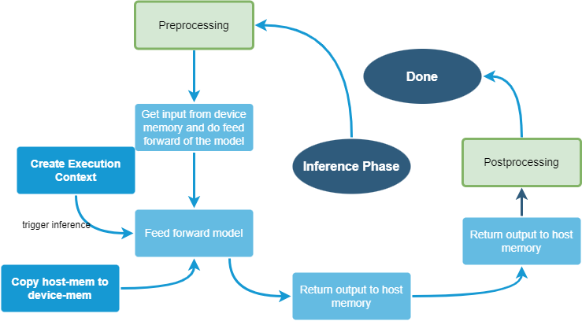
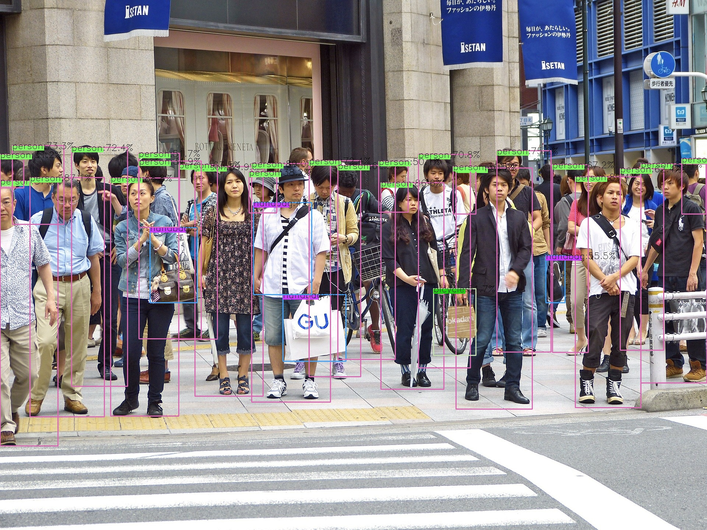
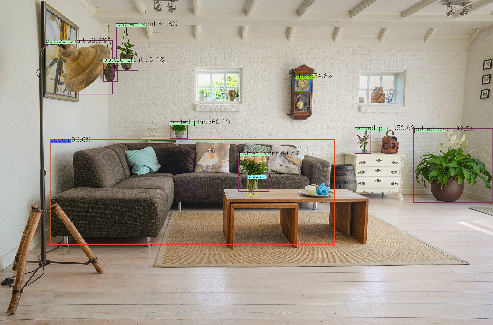
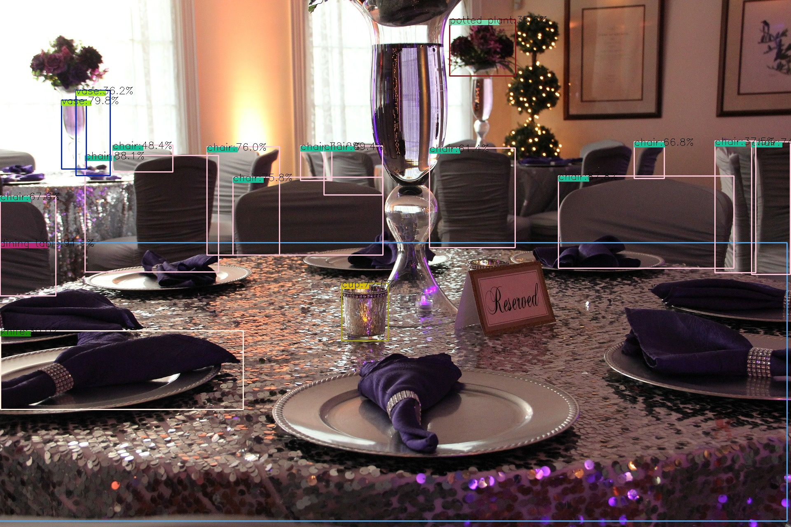
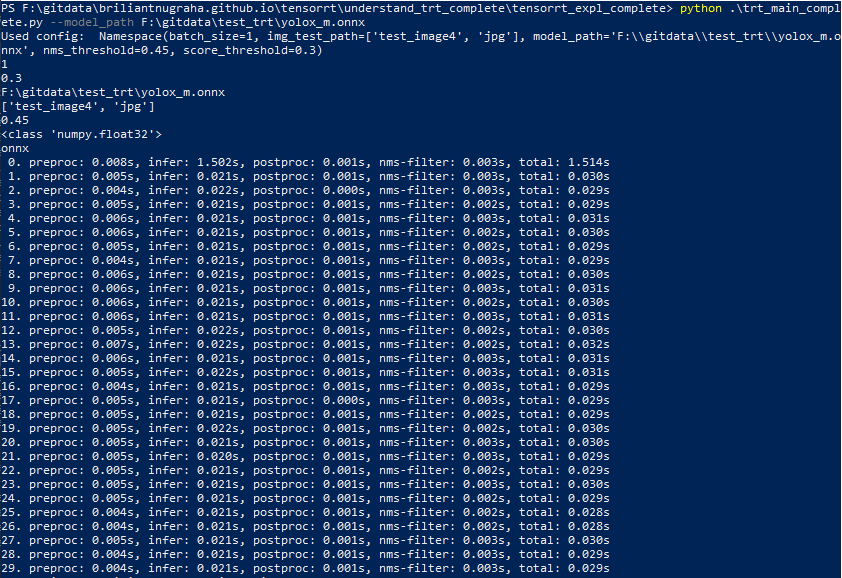
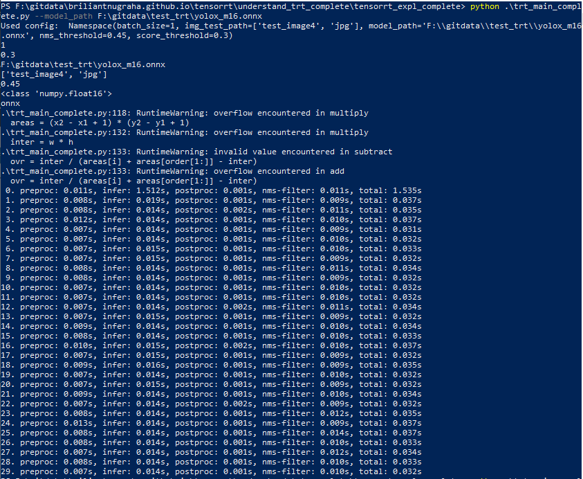
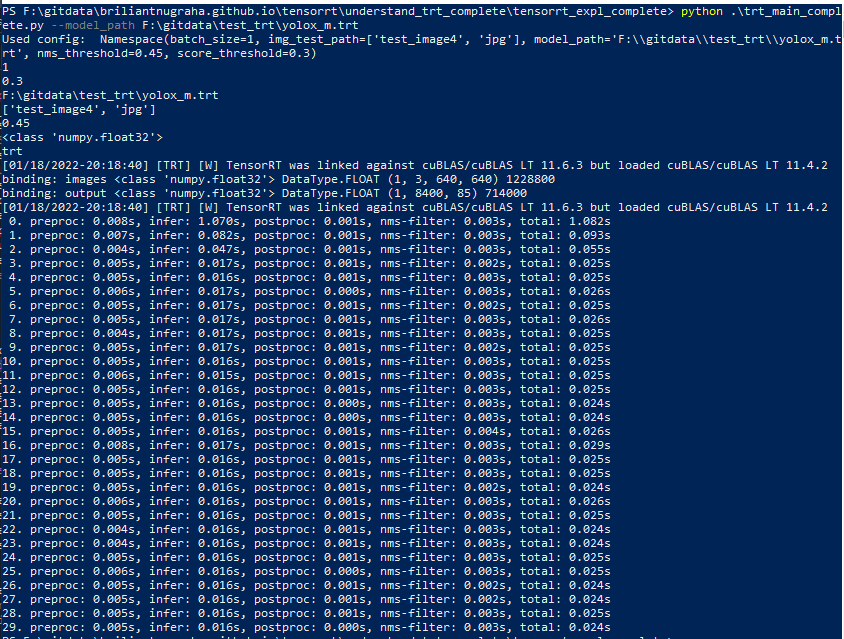
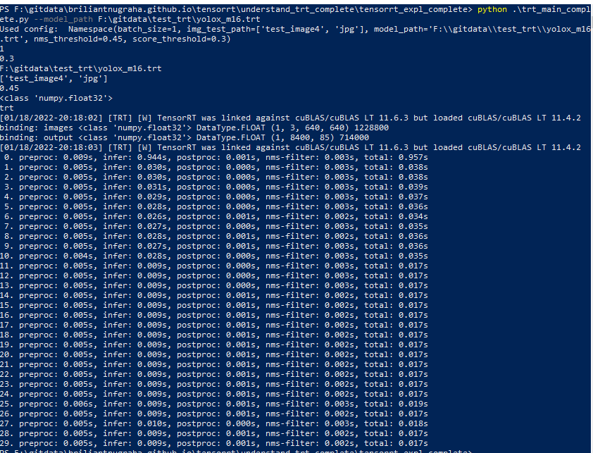
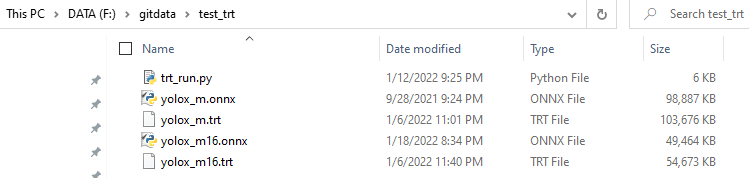

<style>
  .center {
    display: block;
    margin-left: auto;
    margin-right: auto;
    width: 50%;
  }

  td, th {
  border: 1px solid #dddddd;
  /* padding: 8px; */
}
</style>

<div>
  <lic><a href="../../"><h4>MAIN PAGE</h4></a></lic>
  <lic><a href="../"><h4>TENSOR-RT PAGE</h4></a></lic>
</div>

## TENSOR-RT Object Detection Inference with YOLOX 
---
January 24th, 2022

The whole code is available at <a href="./tensorrt_expl_complete/">here</a>.

---

<!-- <p align="center"> -->
<p class="center">
    After completing the <a href="../understand_trt">Tensor-RT's simplified introduction</a>, you might be wondering, is that all there is to it for the object detection with YOLOX model?
</p>
Well, unfortunately, the answer is no!

In order to make the inference to work, we are gonna need two additional processes:
- Preprocessing.
- Postprocessing.

According to [YOLO's official Onnxruntime inference](https://github.com/Megvii-BaseDetection/YOLOX/blob/main/demo/ONNXRuntime/onnx_inference.py), [their preprocess](https://github.com/Megvii-BaseDetection/YOLOX/blob/ca9bc378136ca156a1ccdd22e7015f9b8aac70a0/yolox/data/data_augment.py#L144-L160) consists of resizing image to the given input size while maintaining the aspect ratio, and fill the blank space with zeros. On the other hand, the postprocessing prosess consist of two parts: [convert the output to bounding boxes + score threshold + class name](https://github.com/Megvii-BaseDetection/YOLOX/blob/main/yolox/utils/demo_utils.py#L99-L124), and [do NMS](https://github.com/Megvii-BaseDetection/YOLOX/blob/main/demo/ONNXRuntime/onnx_inference.py#L84) to filter out redundant boxes.


<p class="center">
    <b>Image 1. Full Summary of Object Detection with Tensor-RT. </b>
</p>


---
## How Does It Look in Practice?
In my implementation, I simply put them into the three parts that I've mentioned above. The implementation are separated into preprocessing->inference->postprocessing (as shown in file trt_main_complete.py on Line 259-279)
```python
ylrunner = YOLOX_runner() # instantiate the Yolo interface runner
# preprocess
img_prep, ratio = ylrunner.preprocess(img, shapetuple) 
img_prep = img_prep.astype(dtype)[None,...]

# inference TRT
if 'onnx' != USE_MODE:
    result_infer = model(img_prep,cfg.batch_size)
# inference ONNX
else:
    result_infer = model.run(None, {inpname:img_prep})

# post process
result_pp = ylrunner.demo_postprocess(result_infer[0].reshape(img_prep.shape[0],-1, 85), shapetuple)
result_out = ylrunner.filter_with_nms(result_pp[0], nms_threshold=cfg.nms_threshold, score_threshold=cfg.score_threshold)
```
---
## Snapshot of the Inference Output
In here, we also want to know how the whole processes fare. To do that, we add one function *.vis* that will essentially draw the detection output back to the image input. Here are some example using royalty-free images:


| Input Image      | Tensor-RT Output (FP32) |
| :---        |    :----:   |          ---: |
|       |        | 
|     |   | 
|     |   | 

---
In here, we also try to compare the output using Tensor-RT FP32, Tensor-RT FP116, ONNX FP32, and ONNX FP16. The results are as follow (best to open it in the new tab): 
<table>
  <tr>
    <th>
      <b>ONNX output FP32</b>
    </th>
    <th>
      <b>ONNX output FP16</b>
    </th>
    <th>
      <b>Tensor-RT output FP32</b>
    </th>
    <th>
      <b>Tensor-RT output FP16</b>
    </th>
  </tr>
  <tr>
    <td>
      
    </td>
    <td>
      
    </td>
    <td>
      
    </td>
    <td>
      
    </td>
  </tr>
</table>

As you can see, the results of both Tensor-RT and ONNX, either using FP32 or FP16 are similar, Then, what's the catch?

---
## Investigate the Speed!
In the last part, I also try to compare the speed using Tensor-RT FP32, Tensor-RT FP116, ONNX FP32, and ONNX FP16. The results are as follow (best to open it in the new tab): 
<table>
  <tr>
    <th>
      <b>ONNX output FP32</b>
    </th>
    <th>
      <b>ONNX output FP16</b>
    </th>
    <th>
      <b>Tensor-RT output FP32</b>
    </th>
    <th>
      <b>Tensor-RT output FP16</b>
    </th>
  </tr>
  <tr>
    <td>
      
    </td>
    <td>
      
    </td>
    <td>
      
    </td>
    <td>
      
    </td>
  </tr>
</table>

Based on the inference log, we could see that the inference speed of ONNX-FP16 is faster than the FP32 counterpart. However, interestingly, the NMS speed of ONNX-FP16 is slower than FP32 (total: 34ms vs 30ms). On the other hand, we don't see the slowdown on the Tensor-RT counterparts (both FP32 and FP16's nms perform similar to ONNX-FP32's NMS). We could see that the speed of Tensor-RT+FP16 is faster by almost 10ms than the FP32 one (~25ms vs ~17ms).

---

## Size of Model

Based on the size of the model, ONNXRuntime is slightly smaller compared to Tensor-RT counterparts by around ~5MB. The snapshot of the model size is as the following:


## Summary

In summary, the rank based on speed is as follow:
1. **Tensor-RT FP16 with ~17ms inference speed**.
2. Tensor-RT FP32 with ~25ms inference speed.
3. **ONNXRuntime FP32 with ~30ms inference speed**.
4. ONNXRuntime FP16 with ~34ms inference speed.

---

The rank based on model size is as follow:
1. **ONNXRuntime FP16 with ~48.3MB of model size**.
2. Tensor-RT FP16 with ~53.4MB of model size.
3. **ONNXRuntime FP32 with ~96.6MB of model size**.
4. Tensor-RT FP32 with ~101.2MB of model size.

## There you go!

Hope this explanation helps. If there is any question or mistake with the content, please don't hesitate to let me know, see you in the next blog and stay safe!

